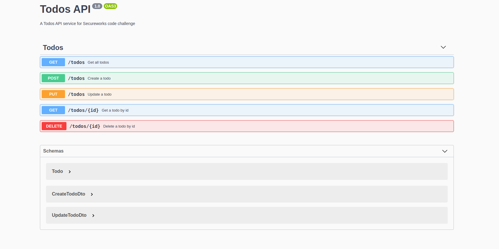

<p align="center">
  <a href="http://nestjs.com/" target="blank"></a>
</p>

## Description

A Todos API service built with [Nest](https://github.com/nestjs/nest) framework.

## How to run locally

First, clone the repo
```bash
git clone git@code.8labs.io:kjohnson/todos-api.git
```

Next, navigate into the project directory and install the dependencies

```bash
npm install
```

Finally, run it locally with
```bash
npm run start
```

## Exploring the service
The API will be listening on port 3000 by default (http://localhost:3000)

To see what endpoints are available, navigate to the swagger UI at http://localhost:3000/api


If you prefer Postman, I've included the postman collection, which you can download <a href="./code-challenge-backend.postman_collection.json" download>here</href>.